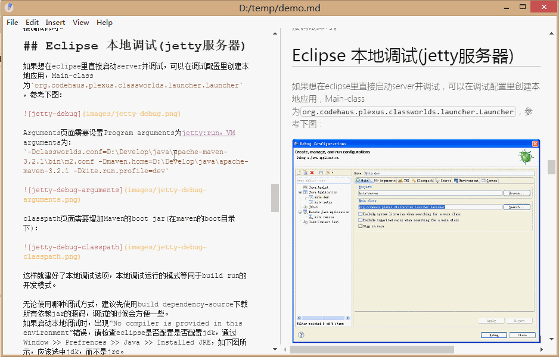

 

## sync scroll

## paste image 

## paste html

## paste word

## more
* UML/flow chart support, [more](https://github.com/skanaar/nomnoml) 
* Tex math support, [more](https://github.com/Khan/KaTeX)
* export html
* export pdf
* optimized performance for large file edit

## download

release  | download 
------   | ------    
windows x64 | [1.1.1 (35M)](https://github.com/i38/i38.github.io/raw/master/public/justmd/justmd-win32-x64-v1.1.1.7z)      
------   | ------  
OSX  |  [1.1.1 (50M)](https://github.com/i38/i38.github.io/raw/master/public/justmd/justmd-osx-v1.1.1.zip)      
------   | ------  
Linux x64  | [1.1.1 (50M)](https://github.com/i38/i38.github.io/raw/master/public/justmd/justmd-linux-x64-v1.1.1.tar.gz)      

## install 
After download, unzip and run justmd.exe

## support

Any question or comment, please:
* comment on this page
* send email to hi@i38.me

