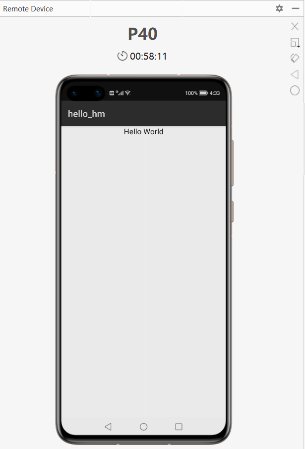

因为要验证我的几个应用能否移植到鸿蒙，仔细看了下鸿蒙，这里分享一下。

## 开发环境

鸿蒙OS的开发工具叫做DevEco Studio，和Android Studio一样，也是基于IDEA。

* 安装时设置好sdk目录，即开始自动下载安装sdk和tools。下载完成后在向导页面中可以看到当前下载的sdk版本为2.1.18，version 5，下文都是基于这个版本。
* 创建一个hello-hm项目，提示项目名称不能用减号，好吧改为hello_hm。
* 打开项目，稍等一下gradle配置，很快项目就完整展现了，整个还是很流畅。

## 编译
因为构建工具是gradle，所以自然在命令行用gradlew assembleDebug试了一下，果然开始编译了：
* 默认用gradle 6.3，下载依赖的时候，服务器自动设为国内的服务器，比安卓环境下的gradle要快多了。
* 不到一分钟，依赖下载和编译完成。

看下输出文件：


39k的hap文件，这个应该就是对应安卓的apk，这是没有签名的debug版本。用7zip打开这个hap文件看看：


这几个文件都能理解，安卓的manifest文件变成了config.json。但让我没想到的是，这里居然包了一个apk文件。试着把这个apk解出来，再用7zip打开，还真是个标准apk


既然是apk，自然放到安卓手机上试一下咯，安装没有问题，图标也看到了，点开...闪退，用adb看一下日志：
```
04-09 15:12:53.334  7450  7450 E AndroidRuntime:        Caused by: java.lang.ClassNotFoundException: Didn't find class "ohos.abilityshell.HarmonyApplication" on path: DexPathList[[zip file "/data/app/com.example.hello_hm-THrK3d5xftGaJlBnx92w_A==/base.apk"],nativeLibraryDirectories=[/data/app/com.example.hello_hm-THrK3d5xftGaJlBnx92w_A==/lib/arm64, /system/lib64, /product/lib64]]
04-09 15:12:53.334  7450  7450 E AndroidRuntime:                at dalvik.system.BaseDexClassLoader.findClass(BaseDexClassLoader.java:230)
04-09 15:12:53.334  7450  7450 E AndroidRuntime:                at java.lang.ClassLoader.loadClass(ClassLoader.java:379)
04-09 15:12:53.334  7450  7450 E AndroidRuntime:                at java.lang.ClassLoader.loadClass(ClassLoader.java:312)
04-09 15:12:53.334  7450  7450 E AndroidRuntime:                ... 16 more
```

看来这个apk是不能跑在纯安卓上的，估计只能跑在鸿蒙上，那这个apk是什么意思? 也许是为了鸿蒙的底层是安卓时，可以跑这个apk达到让底层安卓管理鸿蒙应用的目的吧，反过来也就是说，如果哪一天鸿蒙完全脱离安卓，自然就不需要这个apk了，这只是我的想法，待验证。

## 鸿蒙应用
引用一下官方文档，鸿蒙应用是由一个或多个HAP（HarmonyOS Ability Package）包以及属性文件pack.info文件组成。这点和安卓不同，安卓一个应用是一个apk。


```
HAP是Ability的部署包，HarmonyOS应用代码围绕Ability组件展开，它是由一个或多个Ability组成。Ability分为两种类型：FA（Feature Ability，中文名称：元程序）和PA（Particle Ability，中文名称：元服务）。FA/PA是应用的基本组成单元，能够实现特定的业务功能。FA有UI界面，而PA无UI界面。
```

我的理解，Ability就是组件，FA对应安卓的Activity，PA对应Service。Ability加上资源文件打包起来就是hap，对应安卓的apk。

## 模拟器
我没有运行鸿蒙的真机，只能选择模拟器运行，这个模拟器是云加载的，需要先验证华为开发者账号，然后就可以看到了：


四种模拟器，代表四种设备类型，我就选了P40，启动很快，也不占用本地内存，很好。点击IDE里的调试，就可以运行到模拟器中了，hello world已经跑起来了。



模拟器上有个倒计时，应该是云端模拟器不能占用太长的时间。我试着设置了断点，发现总是进入不了断点，也许是云端模拟器不支持断点调试。

如果要真机调试，看华为的文档，需要先申请调试证书，并配置签名信息，也就是说，估计华为的签名策略会收紧，向苹果看齐，未来鸿蒙的应用市场应该只能有官方一家。

## 工程文件
回到工程文件，整个工程有些部分和安卓还是相似的，这对于安卓程序员来说就比较友好，可以快速上手，列举一些可对照参考的概念：

|       |              安卓 |     鸿蒙 |
| ------|-------------------| -------- |
|项目配置|AndroidManifest.xml|config.json|
|应用标识 |package|bundle|
|字符资源|strings.xml|string.json|
|调试shell |adb|hdc   |
|gradle配置 |build.gradle|build.gradle|

同时打开这个简单项目的布局文件和源码扫了一下，UI部分代码需要完全重写了，不可能兼容安卓的Layout和控件了，大部分的API都不一致了，只是有些在安卓中可以找到一个依稀的影子。

## 总结
整个上手的感觉还是不错，IDE、文档、模拟器都挺顺畅的，hello-world对原安卓开发人员也保持了恰好的“熟悉”，这已经非常不错了，作为经常评估各种奇奇怪怪系统的开发者，一半以上的系统都是因为不成熟的hello-world把我吓退的。但对鸿蒙，这还远远不够，因为大家（无论是用户还是开发者）的期望太高了，我也会继续研究和评估。