因为要验证我的几个应用能否移植到鸿蒙，仔细看了下鸿蒙，当然作为开发者，肯定要从开发环境看起。

## 开发环境

鸿蒙OS的开发工具叫做DevEco Studio，和Android Studio一样，也是基于IDEA。

* 安装时设置好sdk目录，即开始自动下载安装sdk和tools。下载完成后在向导页面中可以看到当前下载的sdk版本为2.1.18，version 5，下文都是基于这个版本。
* 创建一个hellohm项目，选择一个手机项目模板。
* 打开项目，稍等一下gradle配置，很快项目就完整展现了，整个还是很流畅。

## 编译
因为构建工具是gradle，所以自然在命令行用gradlew assembleDebug试了一下，果然开始编译了：
* 默认用gradle 6.3，下载依赖的时候，服务器自动设为国内的服务器，比安卓环境下的gradle要快多了。
* 不到一分钟，依赖下载和编译完成。

看下输出文件：

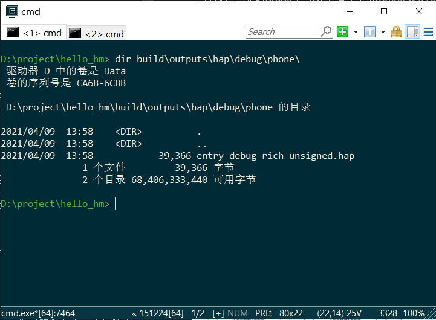

39k的hap文件，这就是一个纯粹的鸿蒙应用，对应安卓的apk，这是没有签名的debug版本，用7zip打开这个hap文件看看：

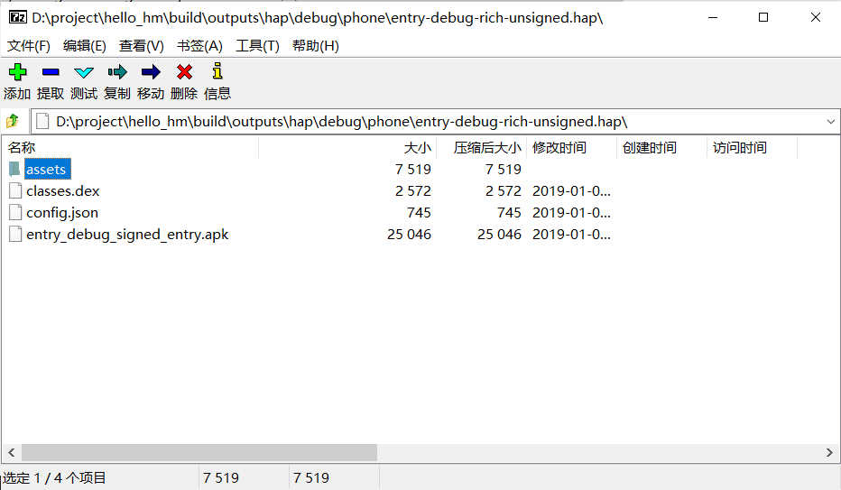

这几个文件都能理解，安卓的manifest文件变成了config.json。但让我没想到的是，这里居然包了一个apk文件。试着把这个apk解出来，再用7zip打开，还真是个标准apk

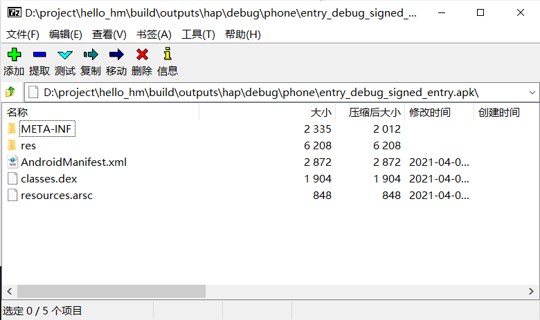

既然是apk，自然放到普通安卓手机上试一下咯，安装没有问题，图标也看到了，点开...闪退，用adb看一下日志：
```
04-09 15:12:53.334  7450  7450 E AndroidRuntime:        Caused by: java.lang.ClassNotFoundException: Didn't find class "ohos.abilityshell.HarmonyApplication" on path: DexPathList[[zip file "/data/app/com.example.hello_hm-THrK3d5xftGaJlBnx92w_A==/base.apk"],nativeLibraryDirectories=[/data/app/com.example.hello_hm-THrK3d5xftGaJlBnx92w_A==/lib/arm64, /system/lib64, /product/lib64]]
04-09 15:12:53.334  7450  7450 E AndroidRuntime:                at dalvik.system.BaseDexClassLoader.findClass(BaseDexClassLoader.java:230)
04-09 15:12:53.334  7450  7450 E AndroidRuntime:                at java.lang.ClassLoader.loadClass(ClassLoader.java:379)
04-09 15:12:53.334  7450  7450 E AndroidRuntime:                at java.lang.ClassLoader.loadClass(ClassLoader.java:312)
04-09 15:12:53.334  7450  7450 E AndroidRuntime:                ... 16 more
```

ClassNotFound，看来这个apk是不能跑在纯安卓上的，只能跑在鸿蒙上，那这个apk是什么意思? 也许是为了鸿蒙的底层是安卓时，可以跑这个apk达到让底层安卓管理鸿蒙应用的目的吧，反过来也就是说，如果哪一天鸿蒙完全脱离安卓，自然就不需要这个apk了，这只是我的想法，用adb验证一下。

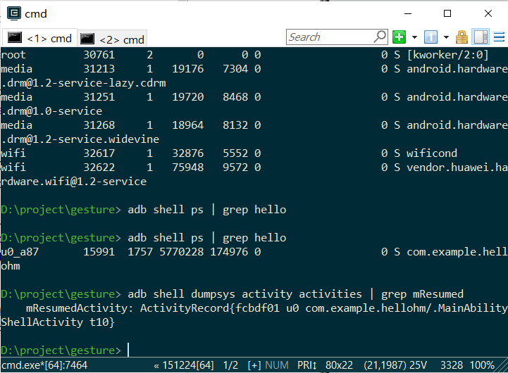

可以看到，通过adb shell可以看到这个鸿蒙应用，用dumpsys可以看到当前的Activity叫做MainAbilityShellActivity，但这是我们代码里没有的东西，从哪里来的？应该就是上面这个自动生成的apk跑出来的。

## 鸿蒙应用
引用一下官方文档，鸿蒙应用是由一个或多个HAP（HarmonyOS Ability Package）包以及属性文件pack.info文件组成。这点和安卓不同，安卓一个应用是一个apk。

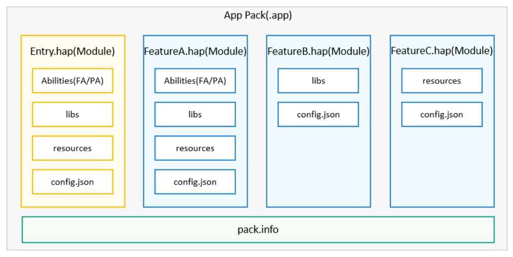

```
HAP是Ability的部署包，HarmonyOS应用代码围绕Ability组件展开，它是由一个或多个Ability组成。Ability分为两种类型：FA（Feature Ability，中文名称：元程序）和PA（Particle Ability，中文名称：元服务）。FA/PA是应用的基本组成单元，能够实现特定的业务功能。FA有UI界面，而PA无UI界面。
```

官方语言挺绕口，我的理解，Ability就是组件，FA对应安卓的Activity，PA对应安卓Service。Ability加上资源文件打包起来就是hap，对应安卓的apk。

## 模拟器
我没有运行鸿蒙的真机，只能选择模拟器运行，这个模拟器是云加载的，需要先验证华为开发者账号，然后就可以看到了：

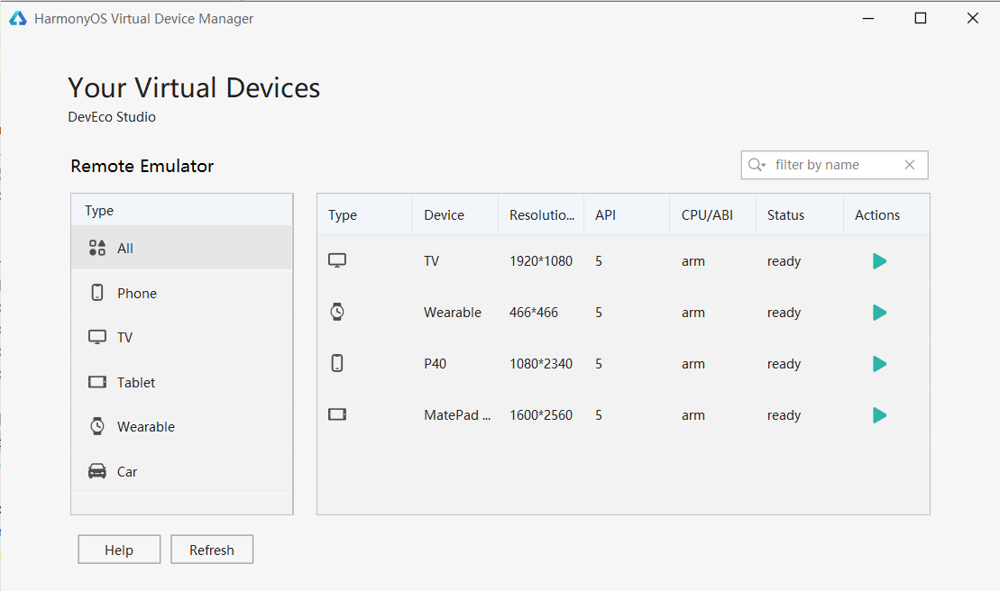

四种模拟器，代表四种设备类型，我要验证我的手机应用，自然就选了P40，启动很快，也不占用本地内存，很好。点击IDE里的调试，就可以运行到模拟器中了。模拟器上有个倒计时，应该是云端模拟器不能占用太长的时间，超时会被释放。

尝试了一下调试，怎么也设置不了断点，按照文档做了各种设置都不行，只好去华为开发者网站提交一个问题，很快第二天收到了回复，问题修复并提供了升级包下载。升级后问题解决，但远程调试的体验确实不佳，很慢，所以实际开发鸿蒙应用，还是需要一个真机，同时看了一下华为的文档，如果要真机调试，需要先申请调试证书，并配置签名信息，也就是说，估计华为的签名策略会收紧，向苹果看齐，未来鸿蒙的应用市场可能只有官方一家。

## 安卓兼容性

我的几个应用虽然是普通安卓应用，但由于都用到了比较多的安卓服务和硬件特性，应该能比较能说明鸿蒙的兼容性，在看我的App之前，先看下这个模拟器的版本，后面兼容性测试都是基于这个版本。

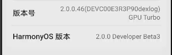

先来看碎片记忆，这个应用使用了悬浮窗和桌面小部件，用adb安装一下，没有问题，运行并导入词库，碎片记忆的悬浮窗已经跑起来了。

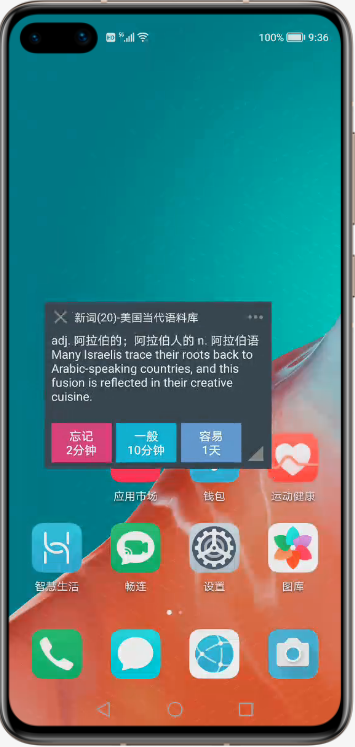

再想试试桌面小部件，可是云端模拟器不支持长按桌面加小部件，只支持双指捏合，这应该是EMUI11的一个改动，在云端模拟器，没办法触发双指，所以暂时还看不到小部件的支持情况。

再试试隐秘参数，这是一个硬件检测和性能测试工具，使用了很多安卓底层的API，在安装之前我是有点怀疑它能否正常运行的，但实际情况是：

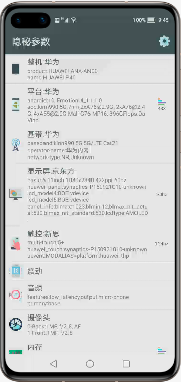

不仅正常运行，还居然测出了显示屏和触控厂商，这在纯安卓版的P40上都测不出的，兼容性看起来没什么问题。性能部分就有意思了，SOC跑分急剧降低，显示刷新率20hz，内存、存储性能全部下降的厉害，按道理，如果只是远程真机，不应该降低性能，只是有网络延迟，所以估计是模拟器导致的，似乎是一个跑在P40物理机上的虚拟机。

最后看下微动手势，这个一个需要无障碍服务和陀螺仪传感器才能工作的的手势工具。

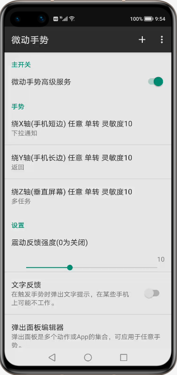

配置无障碍服务没有问题，但可惜因为在云端，没办法触发陀螺仪手势，看来这个只能通过真机才能验证了。但从几个应用整体来看，当前鸿蒙在兼容apk方面没什么问题。

## 鸿蒙工程
回头再来看下鸿蒙工程文件，整个工程有些部分和安卓还是相似的，这对于安卓程序员来说比较友好，可以快速上手，有一些概念也可以相互对照：

|       |              安卓 |     鸿蒙 |
| ------|-------------------| -------- |
|项目配置|AndroidManifest.xml|config.json|
|应用    |Application       |AbilityPackage
|上下文  |Context           |AbilityContext
|页面    |Activity          |AbilitySlice|
|服务    |Service           |Ability
|字符资源|strings.xml       |string.json|
|调试shell |adb             |hdc   |
|gradle配置 |build.gradle|build.gradle|

## 模块划分
因为鸿蒙分布式的特性，鸿蒙的模块分的更细（方便流转和快速加载），官方文档中有一句重要的描述：`HarmonyOS支持应用以Ability为单位进行部署`。

可以这样来分解：
* 一个应用包括多个Ablity，需要在config.json中一一声明。
* Ablity有多种，比如ui类的Page，还有无ui的Data和Service。
* 'Page'不是一个页面，而是多个页面AbilitySlice的汇总，这个术语不太好。
* 多个Slice中，有一个为主，其他slice则需要通过addActionRoute和一个字符串action来绑定，如果slice需要被外部调用，action还要在config.json里声明。
```
setMainRoute(MainSlice.class.getName());
addActionRoute("action.pay", PaySlice.class.getName());
addActionRoute("action.scan", ScanSlice.class.getName());

...config.json...
"skills":[{"actions":["action.pay","action.scan"]}]
```
* Page间可以通过Intent跳转，跳转可以直接指定Bundle和Ability(显式跳转)，也可以通过Action匹配到AbilitySlice(隐式跳转)，这个和安卓比较接近，举例如下：
```
Intent intent = new Intent();
intent.setOperation(new Intent.OperationBuilder()
        .withDeviceId("")
        .withBundleName("com.demoapp")
        .withAbilityName("com.demoapp.FooAbility")
        .build());
startAbility(intent);

intent.setOperation(new Intent.OperationBuilder()
        .withAction(Intent.ACTION_QUERY_WEATHER)
        .build());
startAbilityForResult(intent, REQ_CODE_QUERY_WEATHER);
```

## UI和布局
看一下项目的布局文件和源码，UI部分代码需要完全重写了，不可能兼容安卓的Layout和控件了，大部分的API都不一致了，只是有些在安卓中可以找到一个依稀的影子，但接口都是不一样的。

这说明了一个问题，如果不是以安卓兼容模式运行，现有的安卓应用要想移植到鸿蒙，工作量还是很大的，基本上需要完全重写。

鸿蒙除了支持Java，还支持JS UI，这时鸿蒙比较有特色的一个地方。

## Page和AbilitySlice

这是鸿蒙比安卓复杂的地方，Page包括多个Slice，page本身的生命周期是这样的：

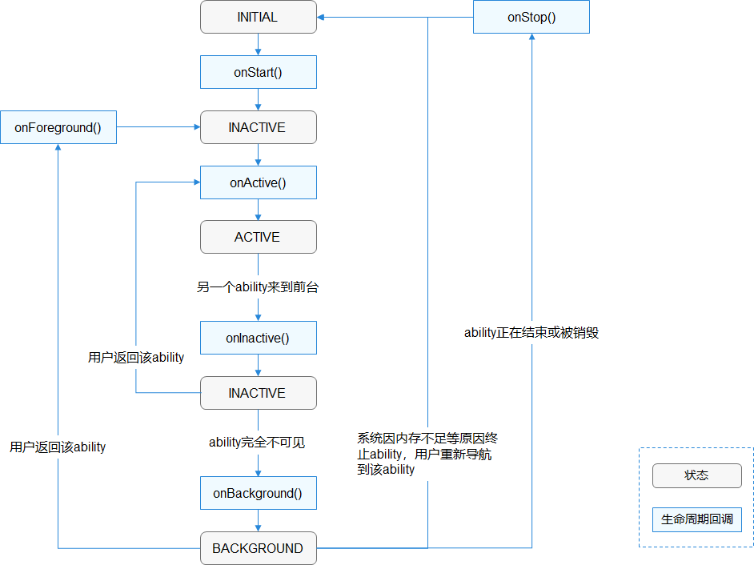

每个slice也是这个状态机，但是两个slice间跳转的时候，每个slice的状态的迁移是有顺序的，比如从A迁移到B:

A.onInactive() -> B.onStart() -> B.onActive() -> A.onBackground()

slice之间可以通过present或presentForResult跳转
```
button.setClickedListener(listener -> present(new TargetSlice(), new Intent()));
```

上面这个new Intent似乎只是用来传递参数，这时不需要action，也就是说如果slice不需要被外部调用，可以随便起一个action名，也不用在config.json里注册，但可惜不能留空，留空会报错。

一个小测试发现，如果两个slice使用同一个layout，则slice页面内容会互相修改。

## 总结

整个上手的感觉还是不错，IDE、文档、模拟器都挺顺畅的，hello-world对原安卓开发人员也保持了恰好的“熟悉”，这已经非常不错了，作为经常评估各种奇奇怪怪系统的开发者，一半以上的系统都是因为不成熟的hello-world把我吓退的，这一点鸿蒙已经有一个好的起点。

在兼容性方面，看起来不用太担心，现在的鸿蒙因为自带安卓，可以运行apk，起码从我的几个App来看，除了无法验证的几个地方，都没有问题，当然未来如果鸿蒙剥离安卓，那就要考验第三方的跟进度了，目前看，应用需要重写才能兼容鸿蒙。
